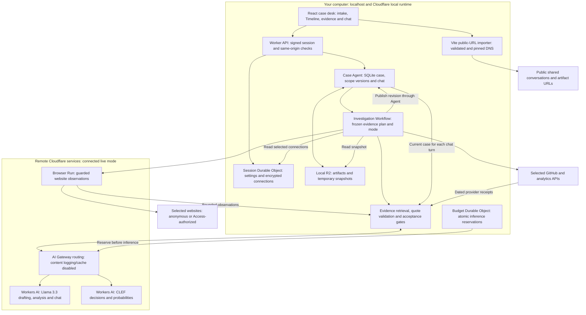

# IntentTrace

**Did the AI deliver what you asked for?** Import the conversation, add the delivered artifact, confirm the requirements, and inspect the evidence behind each assessment.

IntentTrace turns intent, implementation and verification into a versioned investigation case. Its forensic approach is inspired by Gustavo's experience at Business Forensics and ScopeWorth: preserve the original request, distinguish approval from later scope changes, and explain what the evidence actually establishes. The repository's examples are synthetic; employer records, customer data, personal documents and credentials are excluded.

The primary delivery is a **downloadable app running on localhost**, with optional remote Cloudflare AI and Browser Run services. The opening screen asks for a ChatGPT or Claude shared link. JSON exports, pasted conversation text, and an original prompt plus an artifact are available as fallbacks. A deterministic CSV example is offered as a separate starting point.

## Current capabilities

| Capability                           | What you can do                                                                                                                                                                                                                                                |
| ------------------------------------ | -------------------------------------------------------------------------------------------------------------------------------------------------------------------------------------------------------------------------------------------------------------- |
| Conversation and artifact intake     | Read supported public ChatGPT/Claude shares, select a conversation from a supported JSON export, paste labelled messages, or supply the original prompt. Add text/code/CSV/JSON/Markdown/PDF/DOCX files, pasted artifacts or public HTTPS text/code/HTML URLs. |
| Versioned requirements               | Review Llama-generated drafts or edit requirements manually. Confirm a scope version before assessment; later changes supersede earlier findings without rewriting the original approval history.                                                              |
| Evidence investigation               | Collect dated website observations with targeted or expanded coverage, exact target URLs, an expected environment, freshness limits and an explicit evidence plan.                                                                                             |
| Direct acceptance checks             | Check HTTP status, visible text, canonical URLs, independent server HTML, FAQ answers, sampled accordion behavior, reciprocal language links, exact-commit CI and dated aggregate event counts.                                                                |
| Optional protected/provider evidence | Select Cloudflare Access, GitHub Actions, PostHog, Google Search Console or Google Analytics 4 connections for an assessment. Credentials stay in the session-owned encrypted connection vault.                                                                |
| Llama + CLEF assessment              | Retrieve relevant evidence per requirement, validate quotations, combine analyst and classifier decisions, and report support, contradiction or insufficient evidence with gaps and next steps.                                                                |
| Investigation chat                   | Ask about the current scope, timeline, runs, findings and artifacts. Follow evidence links, see real preparation stages, stop/retry interrupted answers and accept suggested next prompts with Tab.                                                            |
| Persistent case desk                 | Open new cases in Timeline with a guided tour. Keep navigation, status, linked evidence and the bottom chat composer visible while Workspace scrolls. Chat interaction opens Conversation and follows its latest message.                                      |
| Local/offline operation              | Switch live AI on or off in application Settings. Intake, case storage, offline chat and the deterministic CSV verifier work without Cloudflare credentials.                                                                                                   |
| Auditable records                    | Inspect source URLs, timestamps, SHA-256 hashes, coverage and versioned findings; download artifacts/reports or delete a case.                                                                                                                                 |

## Setup

### 1. Download and start without credentials

Install **Node.js 22.13 or newer** and npm. Use **Code → Download ZIP**, extract the repository, and open a terminal in the directory containing `package.json`, or clone it. On Windows, choose a reasonably short directory to avoid the local runtime's persisted SQLite path limits.

```sh
npm ci
npm run dev
```

Open the printed localhost address, normally `http://127.0.0.1:5173`. **Clef starts off** in Settings. No login, remote provisioning or API key is needed for this mode. General reviews remain insufficient evidence without a model assessment; the CSV example has its own deterministic verifier.

### 2. Connect your Cloudflare account for live AI and browsing

```sh
npx wrangler login
```

Complete Cloudflare's own browser login. Wrangler retains credentials in its private local configuration outside this repository. Do not paste a token into source files, terminal command arguments or chat.

In your Cloudflare dashboard:

1. Copy the intended account's **Account ID**.
2. Open **AI → AI Gateway**, create a gateway in that account and copy its **Gateway ID**. Disable persistent prompt/response logging and caching. The app also requests `collectLog: false` and `skipCache: true` on model calls.
3. Confirm **Workers AI** and **Browser Run** are available. Review their usage/pricing and complete any service activation or billing steps within Cloudflare.

Then run:

```sh
npm run setup:local
npm run dev
```

Setup asks for **the two public identifiers only** and writes ignored `wrangler.local.local.jsonc`, including remote AI and Browser Run bindings. No external LLM key or Gateway API token is required by this native Workers AI path. If the development server was already running, restart it once to load the new configuration. Rerun setup to update an older connected configuration that lacks the Browser Run binding.

Open **Settings → Use Clef and live AI** to switch live operation on or off without restarting. The server saves this choice for your 24-hour session; it survives refresh. It controls requirement drafting, assessments, investigation chat and online collection. An assessment already started retains its captured mode, and previous findings keep their original provenance. The old `MODE` environment variable does not control this setting.

### 3. Understand what runs locally

| Runs on your computer                                                                 | Uses remote services when enabled                                                                 |
| ------------------------------------------------------------------------------------- | ------------------------------------------------------------------------------------------------- |
| React/Vite interface and public-URL intake                                            | Cloudflare Workers AI: Llama 3.3 and CLEF through the AI binding, with AI Gateway routing options |
| Worker API, Agents/Durable Objects with SQLite, Workflows and R2 emulation            | Cloudflare Browser Run: selected website observations                                             |
| Case records, persisted chat, connection vault and evidence under ignored `.wrangler` | Selected GitHub/analytics APIs, and protected website requests using a selected Access connection |

Local setup requires **no deployed Worker, remote R2 activation, Turnstile widget, OAuth client or administration token**. A random local signing key is generated for session authentication. Keep the server bound to `127.0.0.1`; do not expose this local configuration through a tunnel or public reverse proxy.

Live calls consume account quota and can incur charges. Default inference reservations are **30 calls per session and 200 per day**; these are application controls, not an account-wide bill cap. Turning AI off affects new requests. Browser work and provider reads already started may finish.

For account/gateway errors, rerun setup. For expired login, check `npx wrangler whoami` and use `npx wrangler login` again if needed. See [installation and troubleshooting](docs/INSTALLATION.md) for automation credentials, reset instructions and optional deployment.

## Your first investigation

1. **Import the conversation.** Paste a shared ChatGPT or Claude link and select **Read shared conversation**. Review the imported prompt; attach any omitted artifacts separately. If the share is restricted or unreadable, import JSON, paste `User:` / `Assistant:` messages, or provide the original prompt.
2. **Add the delivered artifact.** Choose a file, public HTTPS text/code/HTML URL or pasted text. PDF/DOCX support extracts text; it does not verify layout, images or runtime behavior.
3. **Create the case and confirm requirements.** Timeline opens first. The optional guided tour points to the requirement editor, confirmation, evidence and assessment controls. Use one testable requirement per line. **Redraft from conversation** proposes new criteria for review; it does not approve them automatically.
4. **Save the evidence plan.** In **Timeline → Evidence sources and checks**, choose coverage, target URLs, expected environment, freshness and requirement-linked checks. Select optional provider connections when the claim needs protected deployment, CI or analytics evidence. Save changes before assessing.
5. **Assess with Clef.** Enable live AI in Settings, then run the assessment. A Workflow snapshots the approved version, evidence plan and mode, collects selected sources, runs direct checks, retrieves evidence and invokes Llama/CLEF. Inspect each finding's quotations, probabilities, gaps, coverage and next steps. With AI off, **Record offline review** makes no model or browser calls.
6. **Investigate the result.** Use the bottom composer to ask follow-up questions. Interaction opens Conversation and scrolls to the latest message. Evidence links take you to the relevant artifact or case record; new evidence and scope changes supersede earlier assessments.

Try [the synthetic conversation](examples/conversation.json) with [its Markdown artifact](examples/release-summary.md). **Open CSV example** demonstrates 18 approved open tasks versus 24 total tasks through correct delivery, scope divergence or missing evidence. A later approval never retroactively authorizes an earlier run.

## Conversation import compatibility

The shared regex validator accepts exact HTTPS vendor hosts and supported paths:

- ChatGPT: `https://chatgpt.com/<route>`, including `/s/<id>`, `/share/<id>` and `/c/<id>`.
- Claude: `https://claude.ai/share/<id>` and `https://claude.ai/code/session_<id>`.

A matching URL establishes format, not public readability. Credentials, query parameters, fragments, encoded paths and dot segments are rejected. Private chats, bot protection, missing attachments and upstream format changes may require the export/paste fallback. Provider login cookies are never imported or forwarded.

Shared Codex conversations of the form `https://chatgpt.com/s/cx_<32 hexadecimal characters>` load messages separately from their page HTML. The local importer supports the anonymous version-1 snapshot endpoint used by the public viewer. It preserves user messages and assistant updates in turn order; reasoning, tool output, file diffs and images are not imported as conversation text. This upstream format is undocumented and may change. Attach delivered artifacts separately and restart the server after importer-code updates.

For multi-conversation exports, select one conversation before storing the case. Reduce large exports to the relevant conversation first. Public URL intake accepts text/code/HTML; download binary artifacts and attach their files instead. The Vite URL importer is local-only; optional public deployment retains manual/export intake.

## Evidence coverage and decision rules

| Coverage mode | Page ceiling | Link-selection rounds | Page-collection window |
| ------------- | ------------ | --------------------- | ---------------------- |
| Targeted      | 10           | 2                     | 2 minutes              |
| Expanded      | 30           | 6                     | 5 minutes              |

These are sampled-collection ceilings. Browser startup and selected provider reads can add time outside the window. Reports list captured/failed sources, discovered URLs not visited and the stopping reason. The model selects from observed candidate IDs, rather than inventing arbitrary targets. Relevant crawler resources and bounded explicit handoff links are also considered.

Captures retain source/final URLs, timestamp, HTTP status, rendered text, metadata, headings, structured data and links. Default browsing is anonymous; a selected Cloudflare Access service token can authorize its exact protected origin. Browser guardrails restrict hosts and public network destinations, permit GET only, and block action-like URLs, images, fonts, media and downloads. Public page scripts run in the remote browser; evidence extraction runs in a separate CDP isolated world. Server-HTML checks use an independently fetched, bounded HTTP response parsed without executing scripts, not the original navigation response.

Select explicit target URLs to prevent another origin from verifying the intended deployment. The environment label is user-declared; it does not prove release identity. Freshness limits exclude older observations. CI requires a full commit SHA; analytics checks require explicit dates, at most 93 days. Passing one check does not establish the rest of a requirement; failed or unverified checks prevent support.

Optional connections cover Access service tokens, GitHub Actions run receipts, PostHog aggregate events (EU/US), Search Console final search-performance rows and GA4 event counts. Enter credentials only in the local connection form, using read access appropriate to the selected service. Google connections accept an existing OAuth access token; the app does not mint credentials, grant scopes or refresh tokens automatically. Saving a connection does not establish successful authentication: collection records that outcome separately. Credentials are excluded from snapshots and reports.

Llama 3.3 analyzes each requirement using retrieved passages and selected observed fields. Citations use closed server-issued IDs and are checked against retained source text. CLEF (`@cf/cloudflare/clef`) classifies qualified evidence packets. A supported/contradicted finding requires analyst agreement, valid quotations, a top classifier probability of at least **75%**, a margin of at least **20 percentage points**, and compatible acceptance-check results. Otherwise the result remains insufficient evidence.

These are application decision thresholds, not calibrated accuracy guarantees. A matching quotation proves text appears in the retained source, not that every inference is correct. Missing, inaccessible, truncated, stale or unvisited evidence remains a gap. Public snapshots do not establish historical delivery, authorship, visual quality, full accessibility, instrumentation correctness, a complete funnel or whole-site coverage.

## Investigation chat and recovery

Every question rereads the server-owned case: approved scopes, timeline events, runs, current/superseded findings, research and relevant artifact excerpts, together with recent chat. Conversation claims and previous answers are context; they do not become observed evidence. Answers resolve known evidence IDs into clickable case and artifact links.

The response stream opens before evidence loading or inference. The interface shows actual preparation stages: **read case evidence → check AI allowance → prepare answer → check evidence links**, plus elapsed time. Answers appear after their structured response and references are validated; the progress display does not expose model reasoning or simulate a token stream.

Use **Stop** or **Retry answer** for an interrupted request. Questions and edited drafts are preserved; retrying the same pending question avoids appending a duplicate. Provider calls have a 60-second deadline, with a 75-second browser watchdog. Quota, timeout, cancellation and provider failures produce explicit notices; exhausted application allowance includes the next daily reset. Case evidence and existing findings remain accessible. SDK maintenance alarms are distinguished from actual case expiry.

A successful live answer can include a short suggested next prompt. It appears as the empty composer's placeholder; **Tab** inserts it for editing, and **Escape** dismisses it. Suggestions never overwrite a draft or send automatically. Offline replies are clearly labelled demonstrations.

## System design



The diagram groups responsibilities; it is not the exact request sequence. General assessment runs **approved snapshot → collection/direct checks → Llama evidence analysis → quotation validation → CLEF classification → conservative decision gates → versioned publication**. CSV assessment uses the separate allowlisted executor and deterministic scope verifier. The Workflow writes snapshots and publishes case evidence through Agent RPCs; the Agent serializes case writes with deletion. Native AI bindings use Gateway routing options, with budget reservation before inference.

This implements the assignment's four components: **LLM** through Workers AI, **coordination** through Agents/Durable Objects and Workflows, **user input** through the React interface and chat, and **memory/state** through SQLite, persisted chat and R2. Local emulation keeps infrastructure setup small while remote AI and browsing remain real service calls when enabled.

## Storage, privacy and resource limits

Cases and sessions expire after **24 hours**. SQLite, persisted chat, evidence and local configuration stay under ignored runtime paths; downloaded reports remain wherever you save them. Live inference sends selected evidence to Cloudflare, and selected external providers receive their own requests. Review service data terms before using confidential material. SHA-256 verifies bytes after receipt, not authenticity or authorship.

| Boundary                   | Limit                                                                   |
| -------------------------- | ----------------------------------------------------------------------- |
| File intake                | 5 MiB per file; up to 300,000 extracted characters; PDFs up to 80 pages |
| Browser observation        | 256 KiB of encoded UTF-8 per observation                                |
| Online collection          | 8 MiB of observation bodies                                             |
| Case evidence bodies       | 16 MiB total                                                            |
| Workflow snapshot          | 20 MiB                                                                  |
| Independent HTTP HTML read | 200,000 bytes, with explicit truncation                                 |

Limits apply before browser transfer and persistence; stored reads check declared and actual streamed bytes before decoding/hash verification. Model packets use bounded excerpts and record omissions. Unrelated clipping, such as a long link list, does not mark complete FAQ/metadata evidence as incomplete.

Failed workflows remove temporary snapshots, and failed persistence removes newly uncommitted bodies. Case deletion blocks writes and removes the entire evidence prefix, including orphan bodies. Initialization and snapshot publication share the deletion lock; late initialization is rejected. A failed cleanup leaves its write gate for retry. Application cleanup also applies locally; deployed lifecycle rules are an additional fallback.

Never commit `.dev.vars`, `.env`, `.wrangler`, `.local`, generated account configuration, exported browser state, credentials or private evidence. See [security boundaries](SECURITY.md).

## Development, evaluation and validation

```sh
npm run check
npm test
npm run test:e2e
npm run build
npm run scan:secrets
```

The browser-capture integration check uses installed Microsoft Edge on Windows. On other systems, first run `npx playwright install --with-deps chromium`. Integration tests use the unconnected local configuration, local Workflows/Durable Objects/R2 and synthetic evidence with explicitly offline model responses. Secret scanning is a heuristic, not proof that every credential pattern is absent.

Run `npm run eval:evidence` for deterministic evidence gates. With a connected live local server running, `npm run eval:evidence:live` assesses the same ten synthetic cases through Llama/CLEF. It consumes 20 model calls, performs no website collection and writes ignored `.local/evaluations/` reports. The gate expects all ten verdicts and zero false support; it is a small regression set, not a calibrated accuracy claim.

The [validation record](docs/VALIDATION.md) distinguishes local/fixture checks, live Cloudflare responses, browser checks and limitations. It includes security regression coverage, actual Llama/CLEF and Browser Run examples, chat progress/recovery and allowance feedback. Historical live checks do not prove every later change was revalidated remotely. See also [architecture](docs/ARCHITECTURE.md), [API](docs/API.md), [product scope](PRODUCT.md) and [design](DESIGN.md).

Public deployment is optional and requires its own R2 resources, Turnstile and signing secrets supplied through Cloudflare service settings or protected Wrangler prompts. The local configuration is not deployable. The [retained OAuth installer prototype](docs/INSTALLER-LEGACY.md) is an advanced experiment; it is not required for downloading and running this app.

Primary references: [Cloudflare Agents](https://developers.cloudflare.com/agents/), [Workers AI](https://developers.cloudflare.com/workers-ai/), [Browser Run](https://developers.cloudflare.com/browser-run/), [CLEF model API](https://developers.cloudflare.com/workers-ai/models/clef/) and [CLEF decision model design](https://blog.cloudflare.com/clef-decision-models/).

## Prompt evidence and AI-assisted development disclosure

IntentTrace was built with OpenAI Codex assistance. Gustavo selected the product direction, experience, requirements and operating constraints, then iteratively requested implementation, testing and corrections. The following author-supplied shared conversations provide supporting evidence of the prompts used:

1. [Shared development conversation 1](https://chatgpt.com/s/cx_6ac8d5f2b4e0819184593b868d3c050a)
2. [Shared development conversation 2](https://chatgpt.com/s/cx_6ac8d66959e88191ae316adc3ba392da)

**Context-window disclaimer:** I used multiple prompts and conversation continuations to manage context-window usage while building this application. The work was iterative rather than generated from a single prompt. These shared links are supporting records, not an exhaustive transcript of every prompt, tool call or validation step.

Selected instructions preserved in the [curated prompt record](PROMPTS.md) include:

> Plan the IntentTrace implementation; it will be hosted in a public GitHub repo, so no hardcoded API keys or secrets. Include setup instructions that ask the user to provide the necessary credentials through the respective Cloudflare service.

> Implement the proposed plan.

> Let's keep this as a downloadable app from Github and it can run locally based on the instructions. Finish up CLEF integration, general chat-history/artifact intake and change the initial demo to be a ChatGPT or Claude shared link that the user needs to input, offer the CSV options as a suggestion

> Improve the happy-path UI/UX by redirecting the user to the Timeline tab instead of the Conversation tab. Add a guided tour showing where the user should confirm the requirements and then assess with Clef, so they know exactly what to do next. Refactor the offline mode toggle into an application setting instead of an environment variable; the end user should be able to enable or disable Clef in real time.

The curated record omits private credentials, personal documents and private runtime records. Model-facing application prompts are checked in under `src/server/`; they are separate from the development instructions. Validation claims are documented in [docs/VALIDATION.md](docs/VALIDATION.md).
