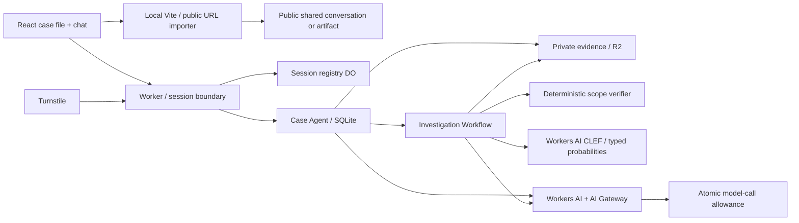

# Architecture

Application settings live in the session registry, with Clef disabled by default. The same localhost app can switch between live and offline operation without restarting after service configuration. Provider bindings establish capability; they do not select the mode. Request handlers and Agent chat read the session choice, while a Workflow captures it at dispatch so later toggles cannot alter its provenance. Session signing and deployed Turnstile verification remain independent of model settings.

The budget reservation occurs before the model request; the diagram groups responsibilities rather than execution order. The React case desk implements the selected mockup A with a chronological timeline, evidence inspector and persistent investigation chat.

## Trust and data ownership

The Worker verifies a signed cookie and the session registry before resolving any case or Agent route. Case IDs alone confer no authority. The Agent name includes the session UUID and case UUID. Browser writes and WebSocket upgrades require a same-origin request. The browser receives only public configuration and artifact metadata; artifact content requires an authorized download.

Case data lives in a dedicated SQLite table inside the case Durable Object. SDK state broadcasts carry only status/revision metadata. SDK chat persistence uses its own tables. Case mutation methods are server-side RPC methods, not decorated browser-callable tools. A case-local mutation queue serializes scope changes and run reservations. Session case-list changes are atomic. A global Durable Object reserves model calls atomically, while the Workers rate limit binding is an additional burst defense, not a strict spending ledger.

## Execution and investigation

The primary path imports a public conversation snapshot, JSON export or labelled transcript, or accepts an original prompt with artifacts. The Node-based Vite importer fetches only explicit public HTTPS URLs, pins validated DNS addresses, revalidates redirects, rejects private networks and never forwards cookies. Pages are parsed without script execution. The importer is local-only; deployment retains manual/export intake.

The client extracts bounded PDF/DOCX text without rendering untrusted HTML or running code. The server hashes exact extracted UTF-8 text and separately retains a supplied original-file digest. Binary originals are not stored. Conversation provenance is supplied, with reception time distinct from historical claims.

For general cases, Llama drafts requirements from user messages. Explicit review creates a scope version; this current approval does not prove original approval timing. A Workflow snapshots the version and artifacts, calls the actual CLEF model with typed choice questions, validates complete probabilities and applies conservative thresholds. Missing artifacts or weak decisions remain insufficient. Encoded CLEF input is capped at 60,000 bytes including questions; excerpts record truncation. Llama explains statuses without changing them. Offline cases never synthesize CLEF outputs. New documents or scopes supersede old findings.

The CSV example retains a separate deterministic path:

1. User confirms a scope version.
2. A unique operation ID reserves a run. Replaying it returns the existing state.
3. The model proposes a schema-validated selection/notes configuration. Offline mode uses the approved configuration without inference.
4. A bounded executor applies that configuration to the synthetic Atlas dataset, generates the export, and records configuration plus before/after snapshots.
5. A Workflow snapshots the evidence revision into R2. Verification runs against that immutable snapshot.
6. The model explains the deterministic results; invalid output or unavailable inference falls back to the recorded checks.
7. Publishing is idempotent by Workflow ID. Findings retain the run and evidence revision. New evidence marks old findings superseded; re-investigation produces a new revision.

Old runs retain their original scope ID. A later scope version never changes their approval history. The divergence scenario injects a visible adapter fault after model configuration; it does not claim that the model itself made the mistake. The missing-evidence scenario retains the run record but withholds its result artifact.

## Services considered

| Service                     | Decision                                                                                                     |
| --------------------------- | ------------------------------------------------------------------------------------------------------------ |
| Workers Static Assets       | Use for same-origin React hosting, API and cookies.                                                          |
| Agents / Durable Objects    | Use for per-case coordination, state, chat and isolated ownership.                                           |
| Workflows                   | Use for durable multi-step investigation and replay-safe publication.                                        |
| R2                          | Use for private artifacts and immutable investigation snapshots.                                             |
| Workers AI                  | Use the assignment's recommended Llama model through a binding.                                              |
| AI Gateway                  | Use centralized model visibility; turn off content collection for this demo.                                 |
| Turnstile                   | Use before allocating anonymous live sessions.                                                               |
| Workers observability       | Use logs/traces; application logs exclude evidence and prompts.                                              |
| D1                          | Defer: cross-case relational search is outside this isolated sandbox.                                        |
| Vectorize / AI Search       | Defer: small structured cases can be verified directly; semantic retrieval would add ambiguity.              |
| Queues                      | Defer: Workflows already owns the background investigation lifecycle.                                        |
| Realtime / voice            | Defer: text chat meets the assignment and makes evidence references easier to inspect.                       |
| Browser Run                 | The installer binds Browser Run and verifies fixed HTML rendering. Arbitrary URL investigation is not implemented. |
| Sandbox                     | Defer arbitrary repository execution; the demonstration executor is allowlisted. |
| Access                      | Optional protection for a private staging hostname; the public demo uses anonymous isolated sessions.        |
| Secrets Store               | Optional organization-wide secret reuse; ordinary Workers Secrets is sufficient for this single application. |

## Failure semantics

The OAuth installer is a separate Worker with an installation Durable Object. It pins the application release checksum and stores only a progress receipt plus an encrypted credential vault. The release bundle stays in Static Assets to avoid Durable Object value-size limits. Provisioning advances one checkpoint at a time and retains completed infrastructure on interruption. See [installation](INSTALLATION.md) for credential lifecycle and operator prerequisites.

A failed model proposal does not silently run a fixture in live mode. Deterministic verification can still complete if only the explanatory model call fails. A duplicate operation does not create another export. Failed operations preserve evidence; the client can request another investigation. After case deletion, reads fail and active Workflow execution is terminated where possible. R2 lifecycle rules handle orphaned snapshots.

Workflow step retries must not be represented as exactly-once model inference: a network interruption after inference but before checkpointing can cause another reservation/request. Model-call budgets count reservations, including failed calls. They bound requests, not a precise currency amount.
